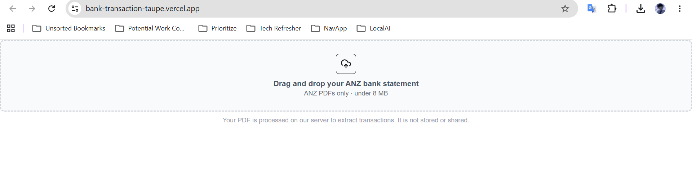
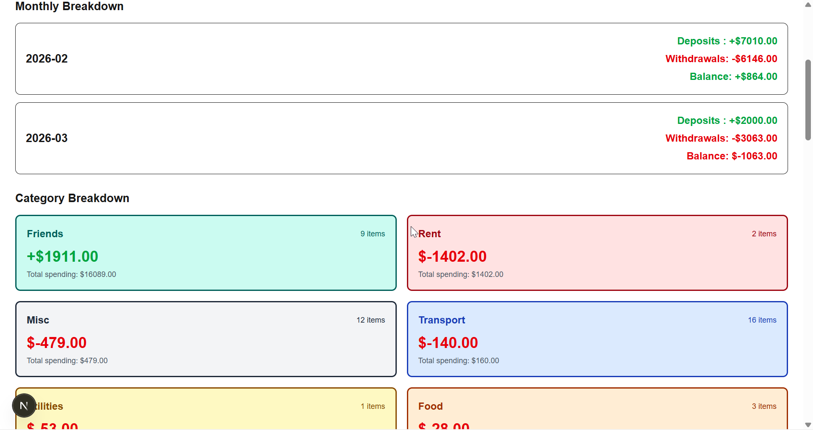

# Bank Transaction Analyser

A personal finance web app that parses ANZ bank statement PDFs and breaks down spending by category and month — no accounts, no storage, no data kept after upload.

**Live:** [bank-transaction-taupe.vercel.app](https://bank-transaction-taupe.vercel.app)

---

## Screenshots





---

## Features

- Drag-and-drop ANZ PDF upload — non-PDFs and files over 8MB are rejected
- Parses transactions: date, description, withdrawal, deposit, running balance
- Categorises spending: groceries, food, transport, utilities, rent, education, shopping, friends, misc
- Monthly breakdown with deposits, withdrawals and net per month
- Export any month — or all transactions — as a CSV
- Privacy-first: PDF is processed in memory and discarded immediately after parsing, never written to disk or stored

---

## Built With

| Layer | Technology |
|---|---|
| Framework | Next.js 16 (full-stack) |
| Language | TypeScript 5 |
| Styling | Tailwind CSS 4 + Radix UI |
| PDF Parsing | pdf-parse |
| Testing | Vitest 4 + Testing Library |
| Deployment | Vercel |

---

## Getting Started

### Prerequisites

- Node.js v18+
- npm

### Installation

```bash
git clone https://github.com/D3lK1ch1/Bank-Transaction.git
cd Bank-Transaction
npm install
```

### Running

```bash
npm run dev      # development server
npm run build    # production build
npm start        # production server
```

### Testing

```bash
npm run test          # watch mode
npm run test:run      # single run
npm run test:coverage # with coverage report
```

---

## How It Works

1. Upload an ANZ bank statement PDF
2. The server extracts the raw text with pdf-parse
3. The parser detects the column format, extracts each transaction line, filters out balance/totals rows, then categorises and groups by month
4. Results are returned as JSON and rendered — the PDF is never saved

---

## Roadmap

- [ ] Smarter categorisation — pattern-based rules instead of static keyword lists
- [ ] Multi-bank support (CBA, NAB, Westpac)
- [ ] Data visualisation — charts per category and month

---

## License
MIT
